# ☁️ Infrastructure Documentation

This directory contains the Terraform code to deploy a **Multi-Service ECS Fargate Architecture** on AWS.

## 🏗️ Architecture Overview

The infrastructure consists of a highly available VPC, an Application Load Balancer (ALB), and an ECS Cluster running two microservices (**Service A** and **Service B**).

### 📊 Diagram

```mermaid
graph TD;
    subgraph VPC ["☁️ VPC (10.0.0.0/16)"]
        subgraph Public_Subnets ["📂 Public Subnets (mult-az)"]
            ALB[("⚖️ Application Load Balancer")]
            IGW("🌐 Internet Gateway")
        end

        subgraph ECS_Cluster ["📦 ECS Cluster (Fargate)"]
            subgraph Service_A_Group ["Service A"]
                ServiceA["🐳 Service A Container<br/>(Port 5000)"]
            end
            
            subgraph Service_B_Group ["Service B"]
                ServiceB["🐳 Service B Container<br/>(Port 5001)"]
            end
        end

        CloudMap["🗺️ AWS Cloud Map<br/>(service.local)"]
    end

    User("👤 User") --> |HTTP:80| ALB
    User --> |HTTP:8080| ALB
    
    ALB --> |Target Group A| ServiceA
    ALB --> |Target Group B| ServiceB
    
    ServiceB -.-> |"HTTP via DNS<br/>service-a.service.local"| ServiceA
    
    IGW <--> Public_Subnets
```



## 🧩 Components

| Component | Resource Name | Description |
|-----------|---------------|-------------|
| **VPC** | `multi-service-vpc` | Network isolation with CIDR `10.0.0.0/16`. |
| **Public Subnets** | `multi-service-public-*` | 2 Subnets across different Availability Zones for high availability. |
| **Internet Gateway** | `multi-service-igw` | Allows traffic to/from the internet. |
| **Load Balancer** | `multi-service-alb` | Public-facing ALB. Routes traffic based on port. |
| **ECS Cluster** | `multi-service-cluster` | Managed cluster for running Fargate containers. |
| **Service Discovery** | `service.local` | Internal DNS allowing services to find each other. |

## 🚀 Services

### Service A
- **Port**: 80 (ALB) -> 5000 (Container)
- **Image**: `mohamedfarag96/service_a:latest`
- **Internal DNS**: `service-a.service.local`

### Service B
- **Port**: 8080 (ALB) -> 5001 (Container)
- **Image**: `mohamedfarag96/service_b:latest`
- **Dependency**: Connects to Service A using internal DNS.

## 🛠️ Usage

1. **Initialize Terraform**:
   ```bash
   terraform init
   ```

2. **Review Plan**:
   ```bash
   terraform plan
   ```

3. **Deploy**:
   ```bash
   terraform apply
   ```

4. **Access**:
   After deployment, Terraform will output the `alb_dns_name`.
   - **Service A**: `http://<alb_dns_name>`
   - **Service B**: `http://<alb_dns_name>:8080`

5. **Clean Up**:
   ```bash
   terraform destroy
   ```
